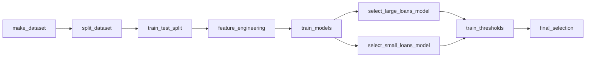
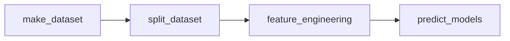

CS610 - Applied Machine Learning - Loan Defaults
==============================

Table of Contents
------------

| S/NO | Section |
| --- | --- |
| 1. | [About this Project](#1) | 
| 2. | [Workflow](#2) | 
| 3. | [Project Organization](#3) | 
| 4. | [Setup Environment](#4) | 
| 5. | [Teardown Environment](#5) | 
| 6. | [Development Workflow](#6) | 
| 7. | [Pull Requests](#7) | 
| 8. | [Project artifacts](#8) |


About this Project <a name="1"></a>
------------

In this project, we explore several options to serve fast, reliable predictions on the probability of loan default. Ideally, the best performing solution can be used to automate internal decision-making or credit scoring processes. 

As loans are one of the most important products and revenue streams for banks, it is critical for banks to minimise the number of bad loans within its portfolio. In some extreme cases, the federal government might be forced to step in and bail out a failing bank by using taxpayer’s money. Therefore, it is important for banks to develop machine learning solutions that can better predict bad loans based on the profile of the customer and the nature of the loan.


Workflow <a name="2"></a>
------------

The project contains two main pipelines

The train pipeline can be run using the following make commands after setting up the environment: `training_pipe` to select the models, `train_thresholds` to train on loan thresholds.

```bash
make training_pipe
make train_thresholds
```

Alternatively, as trained models are already saved under the `models` folders, generate all the data required to run the prediction pipe using 

```bash
make preprocessing
```

### Train Pipeline


The predict pipeline is a proof of concept in order to show how the eventual model would serve predictions. It generates a predictions parquet file in `data/final`, assuming the best model choice is the `300,000` threshold split and the `Random Forest` and `GBM` for small and large loans. 

Run using 

```bash
make prediction_pipe
```

### Predict Pipeline



| Components | Description |
| --- | --- |
| `make_dataset`  | 1. Checks if the dataset exists in `data/raw`<br>2. Reads the file and performs pre-processing<br>3. Save outputs in `data/interim` for feature engineering  |
| `split_dataset`  | 1. Split dataset into df_small and df_large based on loan threshold value. If threshold is 300000, loan from 0 to 299999 goes to df_small|
| `build_features` | 1. Prepares train and validation set<br>2. Drops unnecessary columns for training<br>3. Encodes categorical variables<br>4. Bin numerical variables<br>5. Imputing missing data for MAR variables<br>6. Save outputs in `data/final`  |
| `train_models` | 1. Trains specified candidate models (or train all models if not specified)<br>2. Tune hyperparameters for each model<br>3. Save model weights in `models` folder |
| `evaluate_model`| 1. Evaluate models based on pre-defined metrics<br>2. Output charts to `reports/figures` |
| `predict_model`| 1. Loads pre-trained models from `models`<br>2. Output predictions in a `.csv` format |

Project Organization <a name="3"></a>
------------

The repository is structured in the following hierarchy


    ├── LICENSE
    ├── Dockerfile
    ├── docker-compose.yml <- Docker files to set up a containerized environment
    ├── Makefile           <- Makefile with commands like `make data` or `make train`
    ├── README.md          <- The top-level README for users of this project.
    ├── data
    │   ├── interim        <- Intermediate data that has been transformed.
    │   ├── final          <- The final, canonical data sets for modeling.
    │   └── raw            <- The original, immutable data dump.
    │
    ├── docs               <- A default Sphinx project; see sphinx-doc.org for details
    │
    ├── models             <- Trained and serialized models
    │
    ├── notebooks          <- Jupyter notebooks
    │                         
    ├── references         <- Data dictionaries, manuals, and all other explanatory materials.
    │
    ├── reports            <- Generated analysis as HTML, PDF, LaTeX, etc.
    │   └── figures        <- Generated graphics and figures to be used in reporting
    │
    ├── requirements.txt   <- The requirements file for reproducing the analysis environment, e.g.
    │                         generated with `pip freeze > requirements.txt`
    │
    ├── setup.py           <- makes project pip installable (pip install -e .) so src can be imported
    ├── src                <- Source code for use in this project.
    │   ├── __init__.py    <- Makes src a Python module
    │   │
    │   ├── data           <- Scripts to download or generate data
    │   │   ├── make_dataset.py
    │   │   └── split_dataset.py
    │   │
    │   ├── features       <- Scripts to turn raw data into features for modeling
    │   │   └── build_features.py
    │   │   └── train_test_split_data.py
    │   │
    │   ├── models         <- Scripts to train models and then use trained models to make
    │   │   │                 predictions
    │   │   └── train_models.py
    │   │ 
    │   └── predict        <- Script to predict on new, unseen models
    │       └── predict_model.py
    | 
    └── tox.ini            <- tox file with settings for running tox; see tox.readthedocs.io


Setting up the environment <a name="4"></a>
------------

### Prerequisties 

* Download and install [anaconda](https://www.anaconda.com/products/distribution) 

* Download [docker](https://www.docker.com/products/docker-desktop/) 

* Download [git](https://git-scm.com/downloads) 


Run the following terminal commands 

```
$ git clone https://github.com/csanry/aml.git
$ cd aml
```


Ensure that you are logged into docker hub. Then run the following command to set up the docker environment 

```
$ docker-compose up
```
 
The command launches an Ubuntu-based distro, and a Jupyter Lab environment for running the pipelines. Launch the Lab environment from the terminal by clicking on the generated URL

Check that the environment is correctly set up using the following command:

```bash
make test_environment
```

Tearing down the environment <a name="5"></a>
------------

Close the browser by double tapping ctrl + c on the terminal

Run the following command on the terminal to tear down the environment 

```
docker-compose down
```

Development workflow <a name="6"></a>
------------

We will utilise the [github flow](https://githubflow.github.io/) philosophy where:

* Features should be developed on branches

* Whenever you think that the branch is ready for merging, open a [pull request](https://www.freecodecamp.org/news/how-to-make-your-first-pull-request-on-github-3/) 

* Why? Ensures that main branch is as clean and deployable as possible, no conflicts due to competing branches

* For more information, refer to this [article](https://githubflow.github.io/)

Submitting a pull request example <a name="7"></a>
------------

```bash
# checkout a branch
$ git checkout -b cs --track origin/main

# add and commit changes to the branch
$ git add .
$ git commit -m "message" -m "more detail on changes made" 

# push changes
$ git push origin cs
```

* Head to the main [repo](https://github.com/csanry/aml), find your branch, and click on "new pull request" 

* Enter a __descriptive__ title and description for your pull request

* Click on reviewers on the right side and request a review from `csanry`

* Select `create pull request` 

* For a visual explanation refer to [this document](/pr.pdf)


Project artifacts <a name="8"></a>
------------

* Initial EDA is saved in [notebooks](https://github.com/csanry/aml/blob/main/notebooks/eda.ipynb)

* Models are saved in the [models](https://github.com/csanry/aml/tree/main/models) folder

* Confusion matrices generated from the training process are saved in [reports/figures/confusion_matrix](https://github.com/csanry/aml/tree/main/reports/figures/confusion_matrix)

* ROC curves generated from the training process are saved in [reports/figures/roc](https://github.com/csanry/aml/tree/main/reports/figures/roc)

* The error analysis is saved in [notebooks](https://github.com/csanry/aml/blob/main/notebooks/model_evaluation.ipynb)
